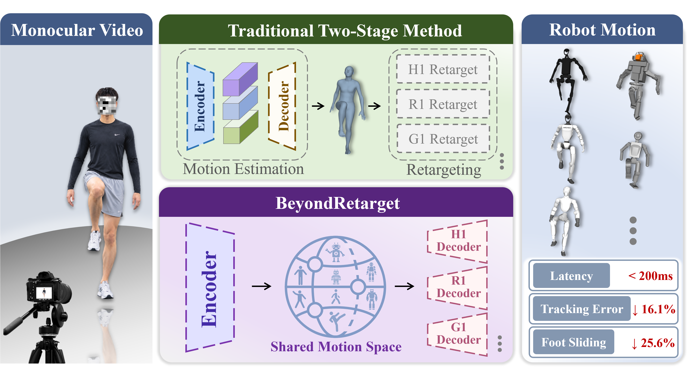
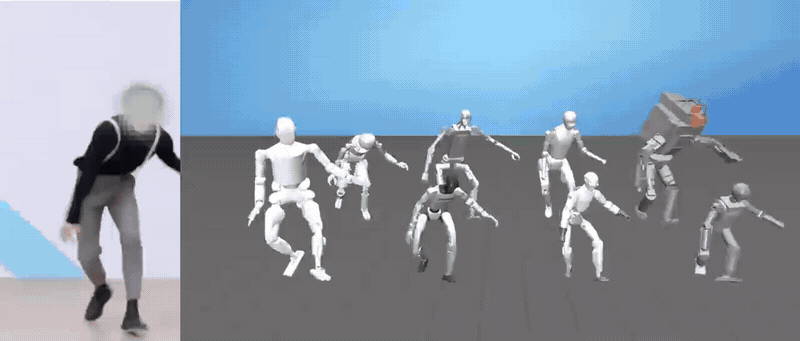

<h1 align="center">BeyondRetarget: Learning Executable Humanoid Motions Directly from Monocular Video</h1>

<div align="center">
  <a href="https://bear-ty.github.io/bear_ty/" target="_blank">Tianyu Xiong</a><sup>1,*</sup>&emsp;
  <a href="https://yeelou.github.io/" target="_blank">Yi Lu</a><sup>1,*</sup>&emsp;
  Jinrui Wang<sup>1</sup>&emsp;
  Ziqi Liang<sup>1</sup>&emsp;
  <br>
  Dandan Lei<sup>3</sup>&emsp;
  Xiaoyang Zhou<sup>4</sup>&emsp;
  Xiao-xiao Long<sup>2</sup>&emsp;
  <a href="https://shenqiu.njucite.cn/" target="_blank">Qiu Shen</a><sup>1,&dagger;</sup>&emsp;
  <a href="https://cite.nju.edu.cn/People/Faculty/20190621/i5054.html" target="_blank">Xun Cao</a><sup>1</sup>
</div>
<div align="center">
  <sup>1</sup>School of Electronic Science and Engineering, Nanjing University, Nanjing, China
  <br>
  <sup>2</sup>School of Intelligence Science and Technology, Nanjing University, Suzhou, China
  <br>
  <sup>3</sup>Jiangsu Mobile Information System Integration Co., Ltd., Nanjing, China
  <br>
  <sup>4</sup>China Mobile Zijin (Jiangsu) Innovation Research Institute Co., Ltd., Nanjing, China
</div>
<div align="center">
  <sup>*</sup>Equal Contribution&emsp;
  <sup>&dagger;</sup>Corresponding Author
</div>
<div align="center">
  <a href="https://bear-ty.github.io/Beyondretarget_page/"></a>
  <a href="https://huggingface.co/spaces/bear-ty/BeyondRetarget"></a>
  <a href="https://arxiv.org/abs/2609.29850"></a>
</div>


BeyondRetarget maps a monocular RGB video directly to executable root motion and joint trajectories for multiple humanoid robots—without requiring reconstructed human motion as an inference-time intermediate.




This demo showcases BeyondRetarget on eight robots, comparisons with other
methods, and real-time teleoperation with BeyondRetarget.

<p align="center">
  
</p>


The currently released code and the method showcased on the project website
both use the **BeyondRetarget base version**, which accommodates the real-time
requirements of teleoperation, but does not yet support floating-camera
scenarios or human motion involving large-scale global trajectories. We plan to open-source a performance edition in future releases, which delivers improved generalization, supports floating cameras, and enables large-range global trajectory estimation. It achieves higher stability and motion capture accuracy across diverse visual environments including indoor and outdoor scenes.

For monocular visual teleoperation, set up SONIC separately and connect it to the GR00T ZMQ interface provided by this project.

## Installation

Requires Linux x86_64 and an NVIDIA GPU with a CUDA 12.1-compatible driver.
The environment uses Python 3.10 and PyTorch 2.3.0.

```bash
git clone https://github.com/bear-ty/BeyondRetarget.git BeyondRetarget
cd BeyondRetarget
bash scripts/setup_rgb2robo.sh
conda activate BeyondRetarget
```

Setup installs the environment, checkpoints, and robot assets from
[Google Drive](https://drive.google.com/drive/folders/12ySWLbVhF8WEGyLR0Ll09DmZm8rZE0Tg),
then validates the installation. Interrupted downloads can be resumed by
rerunning the command. To check an existing installation:

```bash
bash scripts/setup_rgb2robo.sh --check-only
```

Use `--help` for options such as `--skip-download`, `--reuse-env`, and
`--quick-check`. For a pip-only installation, install FFmpeg and run
`pip install -r requirements-pip.txt` in a Python 3.10 environment.
HMR2 feature extraction and motion inference require CUDA; the default
streaming detector runs on CPU.

## Resources

Setup downloads the BeyondRetarget checkpoint, HMR2 and YOLOv8x weights, and
the eight supported robots' descriptions and meshes. See
[assets/README.md](assets/README.md) for their destinations. The HMR2 encoder
and preprocessing code are included in this repository.
To request support for another robot, contact
[tianyuxiong@smail.nju.edu.cn](mailto:tianyuxiong@smail.nju.edu.cn); see
[License](#license) for details.

Inference accepts RGB input directly; no human-model files or ground-truth
annotations are required. For example videos, the
[MotionPRO portal](https://shenqiu.njucite.cn/download) offers `Toy_Sequence.zip`
and the full video archives. Register with an educational or academic email,
complete verification, and accept the data-use terms. Use the front-view
`1.mp4` from each sequence. The
[MotionPRO repository](https://github.com/wjrzm/MotionPRO) provides further
dataset information.

## Inference

Use the single-video command for the complete pipeline, or prepare features
separately for batch videos, image sequences, and inference from existing features.

The eight supported robots are Unitree G1, Unitree R1, Fourier GR1-T1,
Fourier GR2-V3, Unitree H1, Booster T1, Tienkung, and Atlas.

### Video Inference

Run from the project root:

```bash
python app/infer/infer_video.py \
  --video path/to/video.mp4 \
  --robots g1,r1 \
  --output_dir outputs/video_demo
```

The command extracts person boxes and HMR2 features, predicts motion and foot
contacts, and post-processes the motion. Outputs are saved under
`outputs/video_demo/inputs/` and `outputs/video_demo/predictions/`.


### Step-by-Step Inference

**1. Prepare inputs**

For a collection of videos, extract features once and then run offline
inference. Each video gets its own directory under the output root, preserving
relative paths and removing the video extension:

```bash
python scripts/preprocess_videos.py \
  --input_root /path/to/videos \
  --video_glob '*.mp4' \
  --output_root outputs/prepared
```

For MotionPRO dataset, omit `--video_glob` to select only `1.mp4` per sequence.
Without `--output_root`, features are saved beside each video; this requires
one selected video per sequence directory.

For images, place the frames in `sequence/color/` and run:

```bash
python lib/util/gen_bbox_feature.py --sequence_dir /path/to/sequence
```

PNG and JPG frames are sorted by filename. Use names whose alphabetical
order matches the frame order. Preprocessing produces:

```text
sequence/
  bbox.npy          # [T, 8]: frame ID, x1, y1, x2, y2, score, two reserved columns
  vit_features.pt  # [T, 1024]: HMR2 visual tokens
```

Existing visual features can also be used directly. Check prepared inputs with:

```bash
python scripts/validate_inputs.py outputs/prepared
```

The validator checks feature shapes and finite values, optional boxes, and
frame counts against source video or images when available. Only
`vit_features.pt` is required by the motion predictor.

**2. Run inference and post-processing**

Run all eight supported robots on prepared sequences:

```bash
python scripts/run_multirobot_pipeline.py \
  --input_root outputs/prepared \
  --checkpoint assets/checkpoints/rgb2robo_multirobot_clean.pth \
  --output_root outputs/inference
```

Use `--robots` to select a comma-separated subset using these command-line IDs:

| Robot | Command-line ID |
| --- | --- |
| Unitree G1 | `g1` |
| Unitree R1 | `r1` |
| Fourier GR1-T1 | `gr1t1` |
| Fourier GR2-V3 | `gr2v3_8_7_dummy_hand` |
| Unitree H1 | `h1_with_hand` |
| Booster T1 | `t1_serial` |
| Tienkung | `tienkung` |
| Atlas | `atlas_v4` |

- `--phase all` (default): predict motion and contacts, then post-process.
- `--phase infer`: save raw motion and predicted contacts.
- `--phase postprocess`: post-process existing raw predictions and contacts.

Results are saved in
`raw/`, `contact/`, and `postprocess/` under the output root. Each robot's
`*_raw_pred.npz` contains root translation, root rotation, joint DoFs, and FPS;
files under `postprocess/` contain the final corrected motion. Export metadata
records the robot description and joint ordering.
See [postprocess/README.md](postprocess/README.md) for the post-processing API.

### Streaming inference and Visualization

We support fixed-lag video inference, live camera input, MuJoCo visualization,
and GR00T action publishing through ZMQ. See
[stream_infer/README.md](stream_infer/README.md) for commands.

## Repository Layout

```text
app/infer/     Single-video inference entry point
config/        Model settings and robot descriptions
lib/           Models, visual preprocessing, kinematics, and export utilities
postprocess/   Contact prediction, motion filtering, and foot IK
scripts/       Setup, batch preprocessing, input validation, and offline inference
stream_infer/  Video/camera streaming, MuJoCo viewer, and GR00T ZMQ publisher
assets/        Downloaded weights and robot resources
```

## License

BeyondRetarget's original code, documentation, and released model weights are
licensed under [CC BY-NC 4.0](LICENSE). You may share and adapt them for
noncommercial purposes with attribution and an indication of any changes.

Third-party code and assets retain their original licenses and are not
relicensed by this repository. See
[THIRD_PARTY_NOTICES.md](THIRD_PARTY_NOTICES.md).
We thank the authors and maintainers of the third-party projects and assets that make this work possible.

If you would like BeyondRetarget to support additional robot models, please contact [tianyuxiong@smail.nju.edu.cn](mailto:tianyuxiong@smail.nju.edu.cn), and attach the mesh assets and URDF files of the target robot. Within the scope permitted by law, we will train a decoder for your required robot model and add it to our list of supported robots.

## Citation

If you find this code useful, please consider citing:

```bibtex
@misc{xiong2026beyondretarget,
  title={BeyondRetarget: Learning Executable Humanoid Motions Directly from Monocular Video},
  author={Tianyu Xiong and Yi Lu and Jinrui Wang and Ziqi Liang and Dandan Lei and Xiaoyang Zhou and Xiao-xiao Long and Qiu Shen and Xun Cao},
  year={2026},
  eprint={2609.29850},
  archivePrefix={arXiv},
  primaryClass={cs.RO},
  url={https://arxiv.org/abs/2609.29850},
}
```
